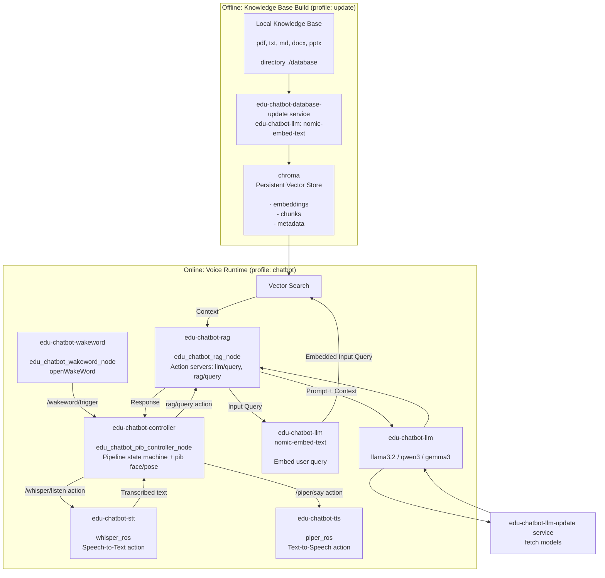
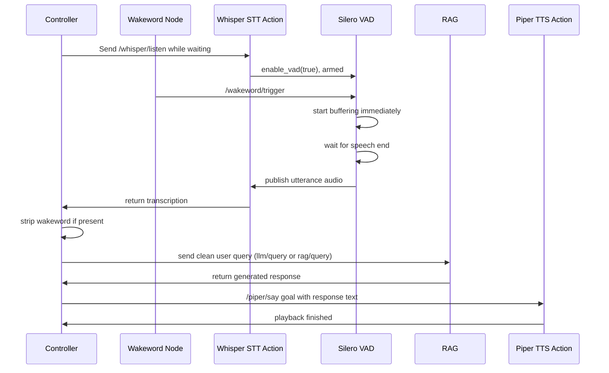

# EDU Chatbot User Guide

Local, voice-interactive RAG pipeline for the pib robot, based on `ollama`, `chromadb`, `whisper`, `piper`, and `openWakeWord`.

This guide is for engineers who want to run, update, and operate the pipeline using the provided shell scripts.

## What This Pipeline Does

- Detects a wakeword from the robot's microphone (`edu-chatbot-wakeword`, `openWakeWord`).
- Transcribes spoken user queries to text (`edu-chatbot-stt`, `whisper_ros`).
- Answers plain LLM questions or RAG questions grounded in a local knowledge base (`edu-chatbot-rag`, backed by `ollama` and `chromadb`).
- Speaks the response back through text-to-speech (`edu-chatbot-tts`, `piper_ros`).
- Orchestrates the whole voice interaction and drives pib's face/pose expressions (`edu-chatbot-controller`).
- Supports CPU, NVIDIA, AMD, and Jetson setups with automatic GPU detection.

## How this pipeline works

Basic component overview:



Speech-to-text Transcription:




## Prerequisites

- Docker Engine + Docker Compose Plugin
- ROS2 CLI available in your terminal when you want to test topics/actions from the host
- A working microphone and speaker exposed to Docker (`/dev/snd`); the wakeword, STT, and TTS containers run `privileged: true` and use `network_mode: host` for audio device access

> Windows host systems only support Nvidia GPU hardware acceleration

> The ROS2 test commands can also be executed inside a running Docker container. Refer to the [developer_documentation](docs/developer_documentation.md) for more infos.

> Install the Docker Compose plugin with this command on the Jetson Nano:
```bash
mkdir -p ~/.docker/cli-plugins
curl -sSL "https://github.com/docker/compose/releases/latest/download/docker-compose-linux-aarch64" -o ~/.docker/cli-plugins/docker-compose
chmod +x ~/.docker/cli-plugins/docker-compose
```

## Folder Setup

### Knowledge Base

All documents that should be accessible by the AI agent are must be stored in the local folder `./database`.
The database update ingests all compatible documents in the `./database` folder, slices the contents into smaller chunks and stores the chunks in a database for fast access.

- The data source for the AI agent is `./database`.
- Put all files you want to use for the LLM pipeline in this folder.
- Supported content is loaded via LlamaIndex readers (`txt`, `md`, `pdf`, `docx`, `pptx`).

### Model list

Model installation is controlled by `ollama/models.txt`.

- Every non-empty line that is **not** commented with `#` will be pulled during update.
- Comment out a model line with `#` to skip installing it.
- Keep `nomic-embed-text` enabled, because it is required for database embeddings.

## Usage of the pipeline

There are four convenience scripts to control the pipeline in the root of this repo.
All scripts only call docker commands which can all be called manually as well for debugging or development.

### 1) Build images

```bash
./edu_chatbot_build.sh
```

What it does:

- Builds all compose services (`docker compose --profile "*" build`).

When to use it:

- First setup
- After Dockerfile or dependency changes
- After updating code in any of the `edu_chatbot_*` ROS2 packages

### 2) Update models and database

```bash
./edu_chatbot_update.sh
```

What it does:

- Auto-detects NVIDIA/AMD/CPU/Jetson and picks compose files accordingly for hardware acceleration.
- Starts model update service: pulls all uncommented models from `ollama/models.txt`.
- Starts database update service: wipes and re-embeds all documents from `./database` (full re-embedding on every run, driven by the `wipe_database:=true` default in `docker-compose.yaml`).
- Stops and removes the update containers when finished.

When to use it:

- After changing `ollama/models.txt`
- After adding/changing/removing documents from `database/`
- Before first runtime start

### 3) Start chatbot runtime

```bash
./edu_chatbot_start.sh
```

What it does:

- Auto-detects GPU setup and starts `edu-chatbot-controller` in detached mode (`--force-recreate`).
- Docker Compose `depends_on` automatically starts the full dependency chain: `edu-chatbot-rag`, `edu-chatbot-stt`, `edu-chatbot-tts`, `edu-chatbot-wakeword`, `edu-chatbot-llm`, and `edu-chatbot-database`.

When to use it:

- Normal operation

### 4) Stop runtime and clean up

```bash
./edu_chatbot_stop.sh          # stop the controller only
./edu_chatbot_stop.sh --all    # stop every service from every profile
```

What it does:

- Without arguments: stops `edu-chatbot-controller` and removes orphans.
- With `--all`/`all`: stops and removes all containers from every compose profile (`chatbot`, `update`, `tools`).

When to use it:

- End of operation
- Before a clean restart

## First-Time Quickstart

```bash
cd edu_chatbot

# 1) Adjust model list
nano ollama/models.txt

# 2) Add docs to be embedded
ls database

# 3) Build images
./edu_chatbot_build.sh

# 4) Pull models + embed docs
./edu_chatbot_update.sh

# 5) Start the voice pipeline runtime
./edu_chatbot_start.sh
```

## ROS interface of the pipeline

### edu_chatbot_rag_node (`edu-chatbot-rag`)

| Action | Type | Description  |
|---|---|---|
| `llm/query` | `edu_chatbot_msgs/action/Query`  | Answer a query without `database/` context |
| `rag/query` | `edu_chatbot_msgs/action/Query`  | Answer a query grounded in retrieved `database/` context |

`Query.action`: request field `string query`, result field `string response`.

| Parameter | Type | Description  |
|---|---|---|
| `llm_model`  | String  | LLM model name. Must match one of the models in `models.txt` |
| `temperature` | Float in [0.0, 1.0]  | Sets the temperature of the LLM model |
| `embedding_model`  | String  | Embedding model name. Must match one of the models in `models.txt` |
| `top_k` | Unsigned Int  | Number of data chunks that are fetched from the database for RAG queries |
| `relevance_threshold` | Float  | Minimum similarity score for a retrieved chunk to be used as context |
| `model_personality` | String  | Description of the LLM model's response behavior |
| `rag_instructions` | String  | Instructions for the LLM how to use the retrieved data chunks to answer the query |
| `warm_up_pipeline` | Bool  | Runs a warm-up query at startup so the first real request isn't slowed down by model loading |

### database_update_node (`edu-chatbot-database-update`)

| Parameter | Type | Description  |
|---|---|---|
| `wipe_database`  | bool  | Delete and recreate the Chroma collection (and clear the ingestion cache) before updating |
| `chunk_size` | Unsigned Int  | Target token size per document chunk |
| `chunk_overlap` | Unsigned Int  | Token overlap between consecutive chunks |
| `semantic_splitting_threshold` | Unsigned Int  | Percentile breakpoint threshold used for semantic chunk splitting |
| `buffer_size` | Unsigned Int  | Sentence buffer size used for semantic chunk splitting |

### edu_chatbot_wakeword_node (`edu-chatbot-wakeword`)

| Topic | Type | Description  |
|---|---|---|
| `/audio/in` (sub) | `audio_common_msgs/msg/AudioStamped`  | Raw microphone audio |
| `/wakeword/trigger` (pub) | `std_msgs/msg/Header`  | Published each time the wakeword is detected |

| Parameter | Type | Description  |
|---|---|---|
| `model_name` | String  | openWakeWord model file (in `models/`), default `hello_robot.onnx` |
| `score_threshold` | Float  | Minimum detection score to trigger |
| `debounce_time` | Float  | Minimum seconds between two triggers |
| `input_topic` / `output_topic` | String  | Overrides for the audio input / trigger output topics |

### edu_chatbot_pib_controller_node (`edu-chatbot-controller`)

Orchestrates the wakeword → STT → RAG/LLM → TTS state machine and drives pib's face/pose expressions via `pib_interface`. Uses action clients for `/whisper/listen` (`whisper_msgs/action/STT`), `rag/query` or `llm/query` (`edu_chatbot_msgs/action/Query`), and `/piper/say` (`audio_common_msgs/action/TTS`).

| Service | Type | Description  |
|---|---|---|
| `enable_pipeline` | `std_srvs/srv/SetBool`  | Enable/disable the voice pipeline state machine at runtime |

| Parameter | Type | Description  |
|---|---|---|
| `wakeup_keywords` | String array  | Phrases matched against the STT transcription to detect the wakeword prefix |
| `keyword_similarity_threshold` | Unsigned Int  | Fuzzy-match score (0-100) required to accept a wakeword match |
| `min_transcription_length` | Unsigned Int  | Minimum character length of a transcription to be treated as a real query |
| `start_enabled` | Bool  | Whether the pipeline starts in the `WAITING` state or `OFF` |
| `log_to_file` | Bool  | Enable additional file logging |
| `stt_topic` / `rag_topic` / `tts_topic` / `wakeword_topic` | String  | Overrides for the action/topic names used by the state machine |

### Speech services

| Node | Interface | Description |
|---|---|---|
| `edu-chatbot-stt` (`whisper_ros`) | Action `/whisper/listen` (`whisper_msgs/action/STT`) | Records audio (Silero VAD) and returns a transcription |
| `edu-chatbot-tts` (`piper_ros`) | Action `/piper/say` (`audio_common_msgs/action/TTS`) | Synthesizes and plays back speech for a given text |

## Runtime Validation

### Service health endpoints

- Ollama: [http://localhost:11434/api/version](http://localhost:11434/api/version)
- Chroma: [http://localhost:8000/api/v2/heartbeat](http://localhost:8000/api/v2/heartbeat)

### Check pulled models

```bash
curl http://localhost:11434/api/tags
```

### ROS2 test

```bash
# first terminal: watch the wakeword trigger
ros2 topic echo /wakeword/trigger

# second terminal: call the RAG action directly, bypassing voice I/O
ros2 action send_goal /rag/query edu_chatbot_msgs/action/Query "{query: 'How can an EduArt robot be programmed?'}"

# enable/disable the voice pipeline state machine
ros2 service call /enable_pipeline std_srvs/srv/SetBool "{data: true}"
```

## Ports

- `11434:11434` -> Ollama API
- `8000:8000` -> Chroma API
- `3000:8080` -> Open WebUI (optional tool profile)

## Operational Notes

- Model and database data are persisted in Docker volumes, so they survive container restarts.
- `edu_chatbot_update.sh` always performs a full database wipe and re-embedding, because the `edu-chatbot-database-update` service command in `docker-compose.yaml` sets `wipe_database:=true` by default.
- If you change the embedding model or embedding strategy, run a full database refresh flow (project-specific procedure) before production use. The database can also be reset manually by deleting the `database-core` docker volume.
- The `edu-chatbot-wakeword`, `edu-chatbot-stt`, and `edu-chatbot-tts` services run with `network_mode: host` and `privileged: true` for direct audio device access; only `edu-chatbot-controller` and `edu-chatbot-rag` need `ROS_DOMAIN_ID`/FastDDS environment overrides passed through the same way.

## Troubleshooting

### Update takes too long or appears stuck

- Large models can take significant time on first pull.
- Large PDF/docx collections can make embedding slow on CPU.

### No response / no speech played back

- Confirm runtime is started (`./edu_chatbot_start.sh`).
- Confirm update was executed at least once (`./edu_chatbot_update.sh`).
- Confirm the requested model exists in `ollama/models.txt` and is pulled.
- Check `/wakeword/trigger` is being published when you speak the wakeword.
- Run `edu-chatbot-controller` with logging verbosity debug and check the console output for STT/RAG/TTS action failures.
- Call `rag/query` directly (see [ROS2 test](#ros2-test)) to isolate whether the issue is in the RAG pipeline or the voice I/O chain.

### Wrong compute backend used

- GPU selection is automatic via `docker/detect_gpu.sh`.
- If detection is wrong on your machine, run compose manually with explicit files:

```bash
# NVIDIA / Jetson
docker compose -f docker-compose.yaml -f docker/docker-compose.nvidia.yaml up -d edu-chatbot-controller

# AMD
docker compose -f docker-compose.yaml -f docker/docker-compose.amd.yaml up -d edu-chatbot-controller
```

## References

- [Ollama API](https://docs.ollama.com/api/introduction)
- [ChromaDB API](https://docs.trychroma.com/reference/python/client#heartbeat)
