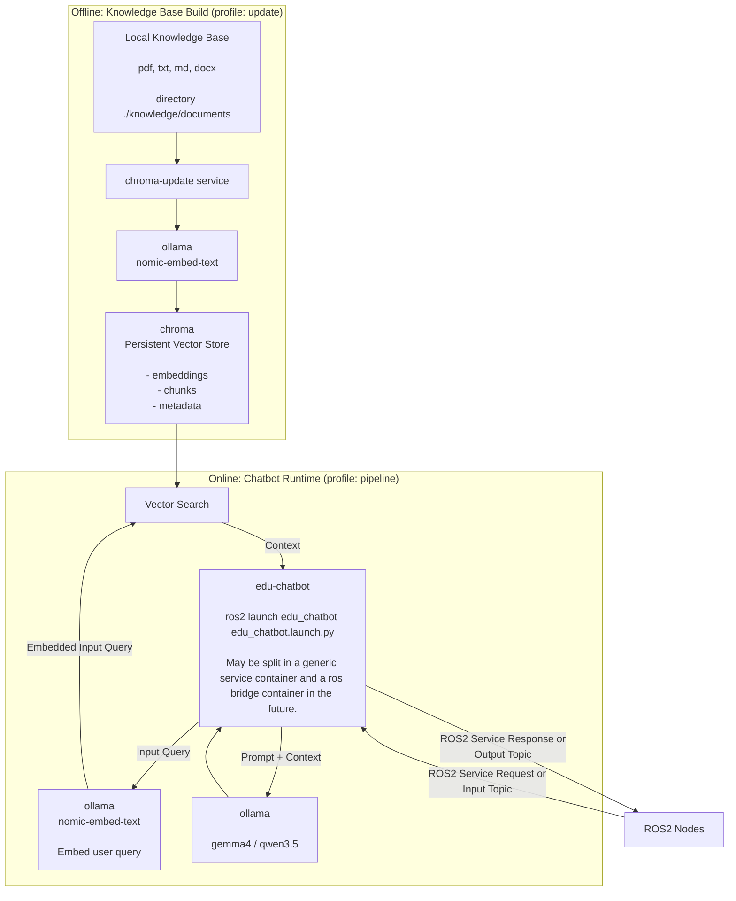

# EDU Chatbot

Local RAG stack based on `ollama` and `chromadb` with ROS2 interface.

## Component Interaction



## Services

Core services:

- `ollama`: local model runtime for generation and embeddings; persistent model cache in `./ollama/models`.
- `chroma`: local vector database for document chunks and embeddings; persistent data in `./chroma/db`.

Profile-based services:

- `edu-chatbot` (profile `pipeline`): main ROS2 chatbot runtime.
- `ollama-update` (profile `update`): pulls the configured model set into Ollama.
- `chroma-update` (profile `update`): updates/rebuilds the knowledge DB.
- `open-webui` (profile `tools`): optional browser UI for manual model/prompt checks.

## Exposed Ports

- `11434:11434` -> Ollama API ([http://localhost:11434](http://localhost:11434))
- `8000:8000` -> Chroma API ([http://localhost:8000](http://localhost:8000))
- `3000:8080` -> Open WebUI ([http://localhost:3000](http://localhost:3000))

Health endpoints:

- [http://localhost:11434/api/version](http://localhost:11434/api/version) (ollama)
- [http://localhost:8000/api/v2/heartbeat](http://localhost:8000/api/v2/heartbeat) (chroma)

## Commands

Base infrastructure only:

```bash
docker compose up -d --build
```

Knowledge/model update:

```bash
docker compose --profile update up --build --abort-on-container-exit
docker compose down --remove-orphans
```

Pipeline runtime:

```bash
docker compose --profile pipeline up -d --build
docker compose stop edu-chatbot
```

Tools:

```bash
docker compose --profile tools up -d
docker compose stop open-webui
```

## Ops

```bash
docker compose ps
docker compose logs -f ollama
docker compose logs -f chroma
docker compose logs -f edu-chatbot
docker compose down --remove-orphans
```