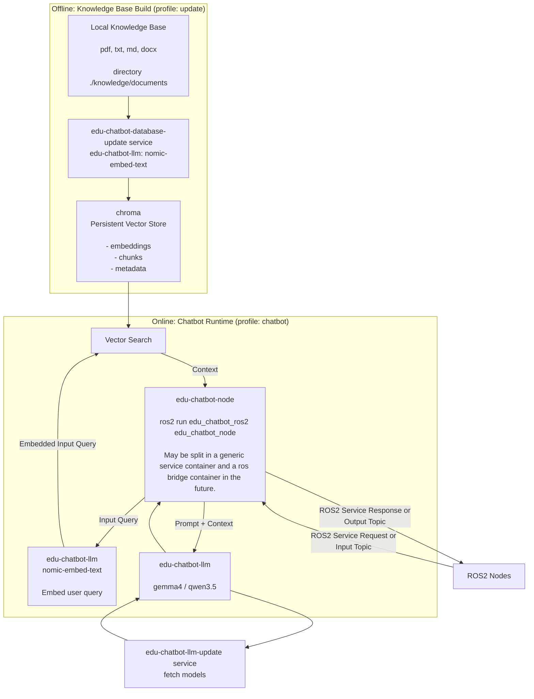

# EDU Chatbot

Local RAG pipeline with a ROS2 interface based on `ollama` and `chromadb`.

## API Reference

- [Ollama API](https://docs.ollama.com/api/introduction)
- [ChromaDB API](https://docs.trychroma.com/reference/python/client#heartbeat)

## Component Interaction



## Services

Core services:

- `edu-chatbot-llm`: local model runtime for generation and embeddings; persistent model cache in Docker volume `llm-models`.
- `edu-chatbot-database`: local vector database for document chunks and embeddings; persistent data in Docker volume `database-core`.

Profile-based services:

- `edu-chatbot-node` (profile `chatbot`): main ROS2 chatbot runtime.
- `edu-chatbot-llm-update` (profile `update`): pulls the configured model set into the LLM runtime.
- `edu-chatbot-database-update` (profile `update`): updates/rebuilds the knowledge DB.
- `edu-chatbot-webui` (profile `tools`): optional browser UI for manual model/prompt checks.

## Exposed Ports

- `11434:11434` -> Ollama API ([http://localhost:11434](http://localhost:11434))
- `8000:8000` -> Chroma API ([http://localhost:8000](http://localhost:8000))
- `3000:8080` -> Open WebUI ([http://localhost:3000](http://localhost:3000))

Health endpoints:

- [http://localhost:11434/api/version](http://localhost:11434/api/version) (ollama)
- [http://localhost:8000/api/v2/heartbeat](http://localhost:8000/api/v2/heartbeat) (chroma)

## Commands

Start the pipeling:

```bash
# CPU
docker compose up edu-chatbot-node

# NVIDIA
docker compose -f docker-compose.yaml -f docker-compose.nvidia.yaml up edu-chatbot-node

# AMD
docker compose -f docker-compose.yaml -f docker-compose.amd.yaml up edu-chatbot-node
```

## Monitoring and Testing


Check gpu access in container (Nvidia only):

```bash
docker run --rm --gpus all nvidia/cuda:12.4.1-base-ubuntu22.04 nvidia-smi
```

Fetch available ollama models:
```bash
curl http://localhost:11434/api/tags
```

Ollama API sample request:

```bash
docker compose exec edu-chatbot-llm bash
```

```bash
curl http://localhost:11434/api/generate -d '{
  "model": "gemma3:270m",
  "prompt": "Answer the following query briefly and concisely in 1 to 3 sentences: Why is the sky blue?",
  "stream": false,
  "options": {
    "temperature": 0.2
  }
}'
```

Define context token length and response token length.
Will reload the model if size is different from before:

```bash
curl http://localhost:11434/api/generate -d '{
  "model": "gemma3:270m",
  "prompt": "Answer the following query briefly and concisely in 1 to 3 sentences: Why is the sky blue?",
  "stream": false,
  "options": {
    "temperature": 0.2,
    "num_predict": 512,
    "num_ctx": 2048
  }
}'
```

ROS test commands:

```bash
ros2 topic pub /rag/input std_msgs/msg/String 'data: "How can a EduArt robot be programmed?"' -1
```
```bash
ros2 topic echo /rag/output --full-length
```

Print all database chunks:
```bash
python3 -c "import chromadb, json; client = chromadb.HttpClient(host='edu-chatbot-database', port=8000); col = client.get_collection('embeddings'); print(json.dumps(col.get(include=['documents']), indent=2))"
```

## LLM Models

Below are the tested LLM models.
The response speed is measured with the above sample query.
The rating is purely subjective.

| Model          | Size   | Quantization | Time RPi5 | Time 4070  | Rating | Comment |
|----------------|--------|--------------|-----------|------------|--------|---------|
| gemma3:270m    | 292 MB | Q4_K_M       | 2.4s      | 1.9s       | 70%    | Feels usable on RPi5 |
| gemma3:1b      | 815 MB | Q4_K_M       | 6.3s      | 2.7s       | 50%    | |
| gemma4:e2b     | 7.2 GB | Q4_K_M       | Too large | 5.8s       | 1%     | |
| qwen3.5:0.8b   | 1.0 GB | Q8_0         | 3m 8s     | 27s        | 0%     | |
| qwen3.5:2b     | 2.7 GB | Q8_0         | Just no.  | 20s        | 0%     | |
| llama3.2:1b    | 1.3 GB | Q8_0         | 9.7s      | 2.3s       | 20%    | |
| ministral-3:3b | 3.0 GB |              |           |            |        | |
