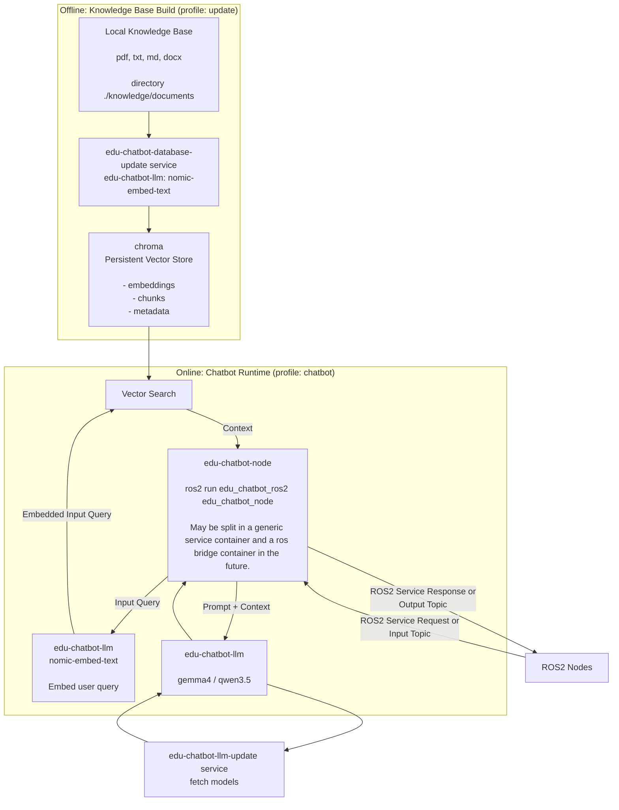

# EDU Chatbot User Guide

Local RAG pipeline with a ROS2 interface based on `ollama` and `chromadb`.

This guide is for engineers who want to run, update, and operate the pipeline using the provided shell scripts.

## What This Pipeline Does

- Runs a local LLM service (`ollama`) for generation and embeddings.
- Runs a local vector database (`chromadb`) for document retrieval.
- Runs a ROS2 node that answers queries via RAG.
- Supports CPU, NVIDIA, and AMD setups with automatic GPU detection.

## How this pipeline works




## Prerequisites

- Docker Engine + Docker Compose Plugin
- ROS2 CLI available in your terminal when you want to test topics from the host

> Windows host systems only support Nvidia GPU hardware acceleration

> The ROS2 test commands can also be executed inside a running Docker container. Refer to the [developer_documentation](docs/developer_documentation.md) for more infos.

> Install the Docker Compose plugin with this command on the Jetson Nano:
```bash
mkdir -p ~/.docker/cli-plugins
curl -sSL "https://github.com/docker/compose/releases/latest/download/docker-compose-linux-aarch64" -o ~/.docker/cli-plugins/docker-compose
chmod +x ~/.docker/cli-plugins/docker-compose
```

## Folder Setup

### Knowledge Base

All documents that should be accessible by the AI agent are must be stored in the local folder `./database`.
The database update ingests all compatible documents in the `./database` folder, slices the contents into smaller chunks and stores the chunks in a database for fast access.

- The data source for the AI agent is `./database`.
- Put all files you want to use for the LLM pipeline in this folder.
- Supported content is loaded via LlamaIndex readers (`txt`, `md`, `pdf`, `docx`, `pptx`).

### Model list

Model installation is controlled by `ollama/models.txt`.

- Every non-empty line that is **not** commented with `#` will be pulled during update.
- Comment out a model line with `#` to skip installing it.
- Keep `nomic-embed-text` enabled, because it is required for database embeddings.

## Usage of the pipeline

There are four convenience scripts to control the pipeline in the root of this repo.
All scripts only call docker commands which can all be called manually as well for debugging or development.

### 1) Build images

```bash
./edu_chatbot_build.sh
```

What it does:

- Builds all compose services (`docker compose --profile "*" build`).

When to use it:

- First setup
- After Dockerfile or dependency changes
- After updating the `edu_chatbot_ros2` code

### 2) Update models and database

```bash
./edu_chatbot_update.sh
```

What it does:

- Auto-detects NVIDIA/AMD/CPU and picks compose files accordingly for hardware acceleration.
- Starts model update service: pulls all uncommented models from `ollama/models.txt`.
- Starts database update service: embeds all documents from the configured document folder.
- Stops update containers when finished.

When to use it:

- After changing `ollama/models.txt`
- After adding/changing/removing documents from `database/`
- Before first runtime start

### 3) Start chatbot runtime

```bash
./edu_chatbot_start.sh
```

What it does:

- Auto-detects GPU setup and starts `edu-chatbot-node` in detached mode.
- Also starts required dependencies (`edu-chatbot-llm`, `edu-chatbot-database`).

When to use it:

- Normal operation

### 4) Stop runtime and clean up

```bash
./edu_chatbot_stop.sh
```

What it does:

- Stops running containers and removes orphans from this compose project.

When to use it:

- End of operation
- Before a clean restart

## First-Time Quickstart

```bash
cd /path/to/03_pipeline

# 1) Adjust model list
nano ollama/models.txt

# 2) Add docs to be embedded
ls database

# 3) Build images
./edu_chatbot_build.sh

# 4) Pull models + embed docs
./edu_chatbot_update.sh

# 5) Start chatbot runtime
./edu_chatbot_start.sh
```

## ROS interface of the RAG pipeline
### edu_chatbot_node

| Topic | Type | Description  |
|---|---|---|
| `/llm/input`  | std_msgs/msg/String  | Query input topic for the LLM (= Questions without `database/` context) |
| `/llm/output` | std_msgs/msg/String  | Response to the LLM query |
| `/rag/input`  | std_msgs/msg/String  | Query input topic for the RAG agent (= Questions with `database/` context) |
| `/rag/output` | std_msgs/msg/String  | Response to the LLM query |

| Parameter | Type | Description  |
|---|---|---|
| `model`  | String  | LLM model name. Must match one of the models in `models.txt` |
| `temperature` | Float in [0.0, 1.0]  | Sets the temperature of the LLM model |
| `embedding_model`  | String  | Embedding model name. Must match one of the models in `models.txt` |
| `top_k` | Unsigned Int  | Number of data chunks that are fetched from the database for RAG queries |
| `model_personality` | String  | Description of the LLM models response behavior |
| `rag_instructions` | String  | Instructions for the LLM how to use the retrieved data chunks to anser the query. |

### database_update_node

| Topic | Type | Description  |
|---|---|---|
| ToDo: add embedding model as parameter | | |

| Parameter | Type | Description  |
|---|---|---|
| `wipe_database`  | bool  | Set to `True` to perform a database wipe before updating it

## Runtime Validation

### Service health endpoints

- Ollama: [http://localhost:11434/api/version](http://localhost:11434/api/version)
- Chroma: [http://localhost:8000/api/v2/heartbeat](http://localhost:8000/api/v2/heartbeat)

### Check pulled models

```bash
curl http://localhost:11434/api/tags
```

### ROS2 test

```bash
# first terminal
ros2 topic echo /rag/output --full-length

#second terminal
ros2 topic pub /rag/input std_msgs/msg/String 'data: "How can an EduArt robot be programmed?"' -1
```

## Ports

- `11434:11434` -> Ollama API
- `8000:8000` -> Chroma API
- `3000:8080` -> Open WebUI (optional tool profile)

## Operational Notes

- Model and database data are persisted in Docker volumes, so they survive container restarts.
- `edu_chatbot_update.sh` only performs actual updates when the database or models.txt files have been changed. When one of the two is unchanged the corresponding component won't be updated.
- If you change the embedding model or embedding strategy, run a full database refresh flow (project-specific procedure) before production use. The database can be reset by deleting the docker volume or by calling the `database_update_node` with the ros parameter `wipe_database:=true`.

## Troubleshooting

### Update takes too long or appears stuck

- Large models can take significant time on first pull.
- Large PDF/docx collections can make embedding slow on CPU.

### No answer on `/rag/output`

- Confirm runtime is started (`./edu_chatbot_start.sh`).
- Confirm update was executed at least once (`./edu_chatbot_update.sh`).
- Confirm the requested model exists in `ollama/models.txt` and is pulled.
- Run the `edu_chatbot_node` with logging verbosity debug and check the console output of the node when sending a `/rag/input` message.

### Wrong compute backend used

- GPU selection is automatic via `detect_gpu.sh`.
- If detection is wrong on your machine, run compose manually with explicit files:

```bash
# NVIDIA
docker compose -f docker-compose.yaml -f docker-compose.nvidia.yaml up -d edu-chatbot-node

# AMD
docker compose -f docker-compose.yaml -f docker-compose.amd.yaml up -d edu-chatbot-node
```

## References

- [Ollama API](https://docs.ollama.com/api/introduction)
- [ChromaDB API](https://docs.trychroma.com/reference/python/client#heartbeat)
